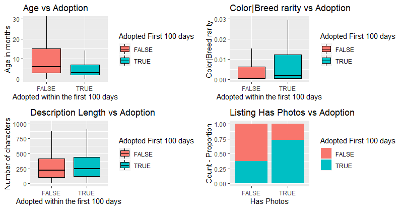
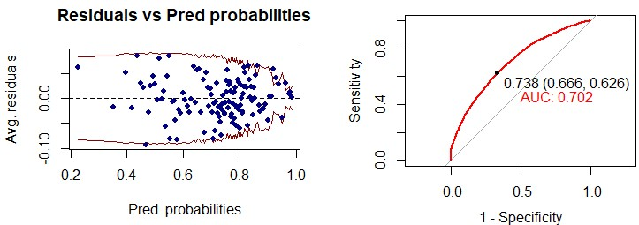
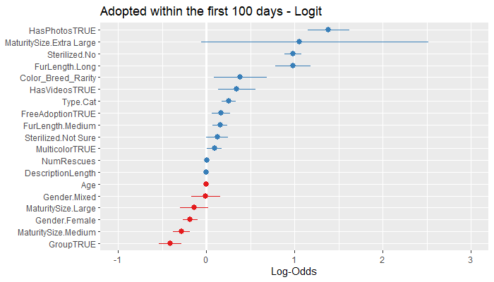

```{r setup, include=FALSE}
knitr::opts_chunk$set(echo = TRUE)
```

## Summary

Not all puppies or kitties get to end up with a family that takes cores of them, feed them and keep them healthy. There is another harsh reality: Stray pets. Numerous estimations back up the fact that this issue is rising across the world, becoming a public health problem as well as being unfair to the animals involved. A novel solution to this problem has been brought up by PetFinder.my, a pet listing website that allows rescuers and temporary owners to offer in adoption pets so that other individuals take care of them. Knowing the value of its data, PetFinder.my partnered with Kaggle to host a competition, where the data for this study came from. By analyzing characteristics of every pet as well as inner aspects of its listing I seek to understand which are the driving factors of pet adoption. By using a logistic regression model I am able to find that there are demographic characteristics of the pets that contribute negatively to their chances of being adopted such as age, whether they are listed in a group of pets and if they are females. On the other hand, the demographic factors that contribute to increasing the likelihood of adoption are pet rarity, if the pet is a cat and if the pet has more than one color. However, the most powerful findings of my study come with the variables that can be changed for every pet. I found that factors such as free adoption and pictures in the listing help a pet getting adopted.

## Introduction

PetFinder.my has been one of the world's leading animal welfare platforms for more than 10 years, with a current database of more than 150 thousand animals. PetFinder collaborates closely with animal lovers, media, corporations, and global organizations to improve animal welfare.

According to the Street Animals Day Foundation, there are 600 million abandoned dogs and cats on the streets of the world. Only in Colombia, 33 thousand pets were abandoned from 2010 to 2016 only, moreover, there are about 1 million stray pets wandering around throughout the country  (Romero, 2019). What is more, only in the United States it is estimated that nearly 3 million animals die in animal shelters every year. Of the 3 million cats and dogs euthanized in shelters each year, approximately 2.4 million (80%) are healthy and treatable and could have been adopted into new homes (Humane Society, 2018).

This problem motivates the question of what factors influence et adoption? how can we increase adoption rates?. This study intends to answer those questions by using data from PetFinder.my and Kaggle.com. The data showcases nearly 15 thousand pet listings including pets characteristics like Age, Gender, Color, Health, Type, Breed, Maturity Size, Fur length, Among others (PetFinder, 2018). As this data belonged to a Kaggle competition, there has been previous work on trying to predict the speed of adoption of a pet based on its characteristics. However, since the main metric of this competition was accuracy, the approaches taken were not that interpretable for the sake of gaining better performance. Additionally, there have been academic studies that have addressed these questions. For instance, by analyzing data from surveys completed by previous owners with a multivariable logistic regression approach it was found that the behavior and temperament of a pet may influence people’s choices when it comes to adopting (Posage et al., 1998).  

This study has two objectives: First, build an interpretable modeling technique that allows us to increase the likelihood of adoption for any new pet coming into the website. Second, build an accurate classification method. If we know which pets have more risk of not being adopted, we can increase the site’s efforts on those to ensure they are adopted. To model the data, use a logistical regression model to analyze what correlates with whether a pet is adopted or not using the 24 variables from the Kaggle competition with additional predictors created from feature engineering. The type of research questions that I will be able to respond are: Are the odds of a pet being adopted affected by its age? Are the odds of a pet being adopted affected by its rarity? Are the odds of a pet being adopted affected by its gender? Are the odds of a pet being adopted affected by whether its profile has pictures or videos? Do the odds of being adopted differ between cats and dogs?.

## Data 

The database contains 14,993 pet listings with 24 variables: AdoptionSpeed - Categorical speed of adoption, Type - Type of animal (1 = Dog, 2 = Cat), Age in months, Breed1 - Primary breed of pet, Breed2 - Secondary breed of pet, if pet is of mixed breed, Gender, Color1 - Color 1 of pet, Color2 - Color 2 of pet, Color3 - Color 3 of pet, MaturitySize - Size at maturity (1 = Small, 2 = Medium, 3 = Large, 4 = Extra Large, 0 = Not Specified), FurLength - Fur length (1 = Short, 2 = Medium, 3 = Long, 0 = Not Specified), Vaccinated - Pet has been vaccinated (1 = Yes, 2 = No, 3 = Not Sure), Dewormed - Pet has been dewormed (1 = Yes, 2 = No, 3 = Not Sure), Sterilized - Pet has been spayed / neutered (1 = Yes, 2 = No, 3 = Not Sure), Health - Health Condition (1 = Healthy, 2 = Minor Injury, 3 = Serious Injury, 0 = Not Specified), Fee - Adoption fee (0 = Free), VideoAmt - Total uploaded videos for this pet, PhotoAmt - Total uploaded photos for this pet. The target variable of my study is whether a Pet as adopted in 100 days or less.


In addition, I created custom variables including: Mixed Breed (Whether the pet has more than one breed), Multicolor (Whether the pet has more than one color), Life Stage (Age variable categorized into puppy/kittie, junior, senior, etc), Description length (Number of characters in the listing description), Fee per capita (Average fee per animal listed in the listing), Num rescues (Number of listings published by the rescues/temporary owner), Color/Breed rarity (1 over the frequency of the specific combination of color and breed by type).

The exploratory data analysis shows some interesting points, as seen in Figure 1:

* The older the pet the less likely is to be adopted
* The rarer the pet the higher the chances of being adopted
* A longer listing description seems to help increase the chances of a pet being adopted
* If a listing has photos the pet is more likely to be adopted





## Model

After performing a thorough exploratory data analysis on the dataset and consulting multiple academic references I approached the model design with a goal in mind: the final logistic regression model should focus on finding relevant and interpretable associations. In this sense, I include all variables that seem to be related to the adoption outcome, given the prior data analysis and background research, even if they are not statistically significant in the full model.

This process began with the inclusion of the main variables in our database: *Age*, *Group*, *FreeAdoption*, *HasVideos*, *HasPhotos*, *Primary.ColorName*, *Type*, *Gender*, *MaturitySize*, *FurLength*, *Vaccinated*, *Dewormed*, *Sterilized*, *Health*, *MixedBreed*, *Multicolor*, *HasName*, *NameLength*, *DescriptionLength*, *NumRescues*, *Breed_Rarity* and *Color_Breed_Rarity*.

Having ready all the ingredients for the model selection process, I proceeded to use together the BIC, AIC and McFadden's R squared as my metrics to find the best possible model. First, I performed a stepwise regression using both the AIC and BIC using the *forward* method, having as benchmark a null model with just the intercept and as scope my baseline model mentioned in the former paragraph. Secondly, I did the same stepwise analysis but this time starting from the baseline model and going step by step dropping features based on both AIC and BIC (backward selection).

Since BIC generally places a heavier penalty on models with many variables, my tests showed simplified models when optimizing for BIC. Moreover, I saw better results when using BIC and comparing metrics between the models, given that it kept the majority of variables that the EDA showed as potentially impactful to the model's *Y*. 

Finally, for the final model, I chose the model with the lowest BIC, the highest McFadden's R squared and the highest quantity of relevant variables according to the exploratory data analysis. 

The final model goes as follows: 

\[
{{Adopted100days}}_{i} = \beta_{0} + \beta_{1}  \mathrm{Age}_{i} + \beta_{2}  \mathrm{Group}_{i} + 
\beta_{3} \mathrm{FreeAdoption}_{i} + \beta_{4} \mathrm{HasVideos}_{i} + \] 
\[\beta_{5} \mathrm{HasPhotos}_{i} + \beta_{6} \mathrm{Color|BreedRarity}_{i} + \beta_{7} \mathrm{Type}_{i} + \beta_{8} \mathrm{Gender}_{i} + \beta_{9} \mathrm{Multicolor}_{i} + \beta_{10} \mathrm{MaturitySize}_{i} + \]
\[\beta_{11} \mathrm{FurLength}_{i} + \beta_{12} \mathrm{Sterilized}_{i} + \beta_{13} \mathrm{DescriptionLength}_{i} + \beta_{14} \mathrm{NumRescues}_{i} + \epsilon_{i}
\]



As seen in the model evaluation plots above (Figure 2), the model behaves well. In addition, I calculated the VIF coefficient for each of the variables finding no risk of multicollinearity issues. 

\newpage

\begin{table}[ht]
\centering
\begin{tabular}{rrrrr}
  \hline
 & Estimate & Std. Error & z value & Pr($>$$|$z$|$) \\ 
  \hline
(Intercept) & -1.3411 & 0.1462 & -9.17 & 0.0000 \\ 
  Age & -0.0061 & 0.0011 & -5.43 & 0.0000 \\ 
  GroupTRUE & -0.4119 & 0.0665 & -6.20 & 0.0000 \\ 
  FreeAdoptionTRUE & 0.1649 & 0.0527 & 3.13 & 0.0018 \\ 
  HasVideosTRUE & 0.3393 & 0.1086 & 3.13 & 0.0018 \\ 
  HasPhotosTRUE & 1.3827 & 0.1194 & 11.58 & 0.0000 \\ 
  Color\_Breed\_Rarity & 0.3839 & 0.1532 & 2.51 & 0.0122 \\ 
  Type.Cat & 0.2552 & 0.0411 & 6.22 & 0.0000 \\ 
  Gender.Female & -0.1860 & 0.0429 & -4.33 & 0.0000 \\ 
  Gender.Mixed & -0.0086 & 0.0838 & -0.10 & 0.9181 \\ 
  MulticolorTRUE & 0.0905 & 0.0432 & 2.09 & 0.0363 \\ 
  MaturitySize.Medium & -0.2845 & 0.0483 & -5.89 & 0.0000 \\ 
  MaturitySize.Large & -0.1397 & 0.0800 & -1.75 & 0.0809 \\ 
  MaturitySize.Extra Large & 1.0497 & 0.6353 & 1.65 & 0.0985 \\ 
  FurLength.Medium & 0.1537 & 0.0412 & 3.73 & 0.0002 \\ 
  FurLength.Long & 0.9791 & 0.1028 & 9.53 & 0.0000 \\ 
  Sterilized.No & 0.9800 & 0.0495 & 19.78 & 0.0000 \\ 
  Sterilized.Not Sure & 0.1219 & 0.0644 & 1.89 & 0.0583 \\ 
  DescriptionLength & 0.0004 & 0.0001 & 7.22 & 0.0000 \\ 
  NumRescues & 0.0062 & 0.0004 & 16.94 & 0.0000 \\ 
   \hline
\end{tabular}
\end{table}



As seen in the results report above, the significant positive effects over the log-odds of an animal being adopted within the first 100 days are: Having pictures or videos on its listing, not being sterilized (counter-intuitive), having a long or medium fur length, being rare in terms of breed and color, being a cat, having zero adoption fee, being posted by an experienced rescuer/temporary owner, having a long description and being multicolor. As for the negative effects on the log odds the model shows that the likelihood of being adopted decreases when: The pet gets older, the size at maturity is medium or large, the pet is a female and the listing is of a group of pets.


## Conclusions

This study shows that there are demographic characteristics of the pets that contribute negatively to their chances of being adopted such as age, whether they are listed in a group of pets and if they are females. In contrast, the demographic factors that contribute to increasing the likelihood of adoption are pet rarity (In terms of color and breed), if the pet is a cat and if the pet has more than one color. However, there can formulate some actionable items from the findings of my study regarding non-demographic characteristics. I found that factors such as free adoption and pictures in the listing help a pet getting adopted. Moreover, if the rescuer/temporary owner writes a longer description for the listing the chances of adoption increase. Also, the experience of the rescuer has an impact on adoption. The more listings the rescuer has had the higher the chances of the pet being adopted.

In this sense, To increase the owner-pet match the listings should require to upload a picture. Additionally, petfinder.my's system should not allow the creation of Group listings, instead, there should be created a separate listing for each pet. When it comes to adoption fees, a zero adoption fee should be implemented for pets that have a lower likelihood of being adopted within 100 days. Finally, in terms of the rescuers/temporary owners, they should be motivated to write longer descriptions to increase the chances of adoption for the pet. Furthermore, the experienced rescuers should be motivated to help low adoption probability pets given their positive effect on the adoption outcome. 

In terms of the limitations of the study, the number of predictors for the study will enhance the robustness of the conclusions. There may be some confounding factors that we are not taking into account when developing the model. Adding the behavior of the people that see the listings (number of clicks, interactions, comments) will add variability to the observations and help with the overall evaluation. Also, It would be better to have more granularity on the variable of adoption speed, given that currently, we have information only for time frames. If we had days until adoption, this problem could have been modeled as a survival analysis and the results should be more precise.

For further study on this issue, the images of the pets could be harnessed in order to add more information to the statistical modeling. Features such as photo quality, lighting condition or even pet posture might be related to the adoption outcome and may increase the precision of the modeling technique. Also, the descriptions of the listing could shed more light on how the tone, sentiment, and drafting of the description affect the chances of adoption, maybe positive descriptions have higher chances or adoption. In addition, a more efficient way to do increase the adoption rate is to create a matching tool (sort of a recommendation system) in which every owner given its characteristics would be matched with the perfect companion. However, we do not have data on the owners an this would be a further effort to deep into this study.


## References

* Posage, J.M., Bartlett, P.C., & Thomas, D.K. (1998). Determining factors for successful adoption of dogs from an animal shelter. Journal of the American Veterinary Medical Association, 213, 478–482.

* Petfinder.my. (2018, December). PetFinder.my Adoption Prediction, Version 1. Retrieved November 5, 2019 from https://www.kaggle.com/c/petfinder-adoption-prediction/data.

* Romero, G. (2019, April 3). En Colombia hay más de un millón de animales en la calle. Uniminuto Radio. Retrieved from https://www.uniminutoradio.com.co

* The Humane Society (2018). Pets by the numbers. Retrieved Dec 7, 2019, from https://www.humanesociety.org/resources/pets-numbers

## Appendix

Link to GitHub repository for the project: http://bit.ly/ids-702-jdm127
